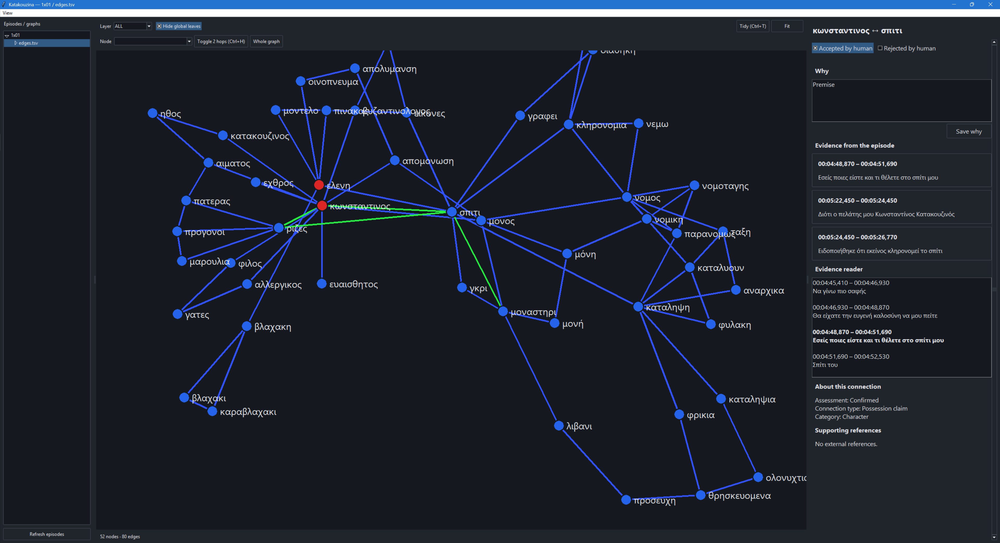
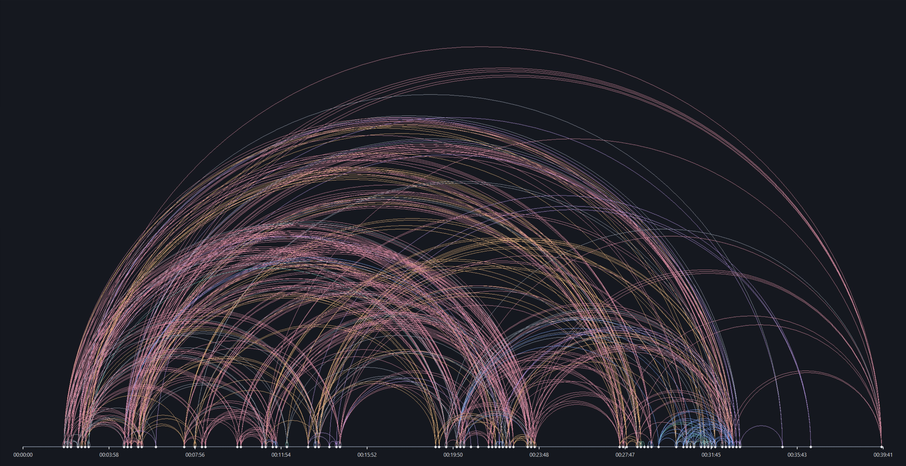

# Katakouzina

Katakouzina helps humans curate **concept and relationship graphs** extracted from subtitled media: videos, TV series, films, lectures, and anything else with subtitles.

*The screenshot is for demonstration purposes only. Any third-party content shown remains subject to its respective rights and is not covered by the MIT license.*

Its AI-friendly schema lets an agent do most of the initial extraction and organization. A human can then explore the graph, check the evidence, and refine its connections.

Human decisions are preserved and identified separately, so an agent can recognize those judgments and build on them. The agent can then complete and refine the graph before another human review. This iterative workflow keeps human judgment central while saving time on the repetitive work.

Licensed under the [MIT License](LICENSE).

## Tools

### Arc timeline

Visualizes relationships over narrative time, making long-range connections and temporal structure easy to inspect.

